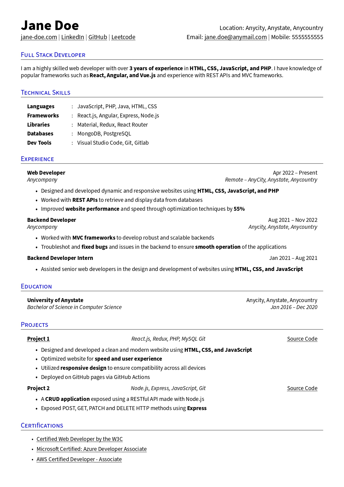

[![MIT License][license-shield]][license-url]
[![LinkedIn][linkedin-shield]][linkedin-url]

<!-- Header -->
 

  

  <h3 align="center">Rezume</h3>

  

    An awesome LaTeX resume template to jumpstart your job search!
     
     
    <!-- <a href="">View on Overleaf</a> -->
    <!-- · -->
    <a href="https://www.overleaf.com/latex/templates/rezume/kfrvqywfkwjs">View on Overleaf</a>
    |
    <a href="https://github.com/nanup/Rezume/issues">Report Bug</a>
  

<!-- TABLE OF CONTENTS -->

  
Table of Contents

  <ol>
    <li>
      <a href="#about-the-project">About The Project</a>
    </li>
    <li>
      <a href="#getting-started">Getting Started</a>
      <ul>
        <li><a href="#prerequisites">Prerequisites</a></li>
      </ul>
    </li>
    <li><a href="#license">License</a></li>
    <li><a href="#contact">Contact</a></li>
    <li><a href="#acknowledgments">Acknowledgments</a></li>
  </ol>

<!-- ABOUT THE PROJECT -->

## About The Project

  
   
   
  <a href="/rezume.pdf">View Generated PDF</a>

 
There are many great LaTeX resume templates available on GitHub and Overleaf; however, I didn't find one that really suited my needs so I created this enhanced one. I want to create a resume template so amazing that it'll be the last one you ever need.

Here's what's in here:

- **Super clean layout**, looks sleek while being highly intuitive for glancing
- **Beginner friendly**, almost every command explained with comments
- **Customization**, pre-written commands and helpful comments for customization

Of course, no one template will serve all purposes since your needs may be different. You may suggest changes by forking this repo and creating a pull request or opening an issue.

Use the `rezume.tex` to get started.

<!-- GETTING STARTED -->

## Getting Started

### Prerequisites

You will need LaTeX typesetting system to be able to generate pdfs from the `.tex` file.

I use [MiKTeX](https://miktex.org/), a free and open-source distribution of the TeX/LaTeX typesetting system for Microsoft Windows.

[MiKTeX](https://miktex.org/) provides the tools necessary to prepare documents using the TeX/LaTeX markup language, as well as a simple TeX editor: [TeXworks](https://www.tug.org/texworks/).

<!-- LICENSE -->

## License

Distributed under the MIT License. See `LICENSE.txt` for more information.

<!-- CONTACT -->

## Contact

Nanu Panchamurthy - nanup.personal@gmail.com

Project Link: [https://github.com/nanup/Rezume](https://github.com/nanup/Rezume)

<!-- ACKNOWLEDGMENTS -->

## Acknowledgments

- Based on [sb2nov/resume](https://github.com/sb2nov/resume/)
- [Choose an Open Source License](https://choosealicense.com)

(<a href="#readme-top">back to top</a>)

[license-shield]: https://img.shields.io/github/license/othneildrew/Best-README-Template.svg?style=for-the-badge
[license-url]: https://github.com/othneildrew/Best-README-Template/blob/master/LICENSE.txt
[linkedin-shield]: https://img.shields.io/badge/-LinkedIn-black.svg?style=for-the-badge&logo=linkedin&colorB=555
[linkedin-url]: https://linkedin.com/in/nanu-panchamurthy
